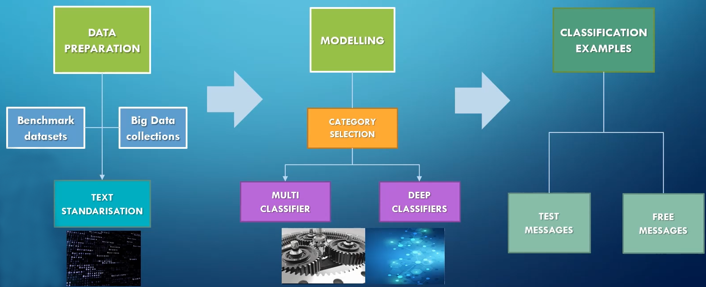
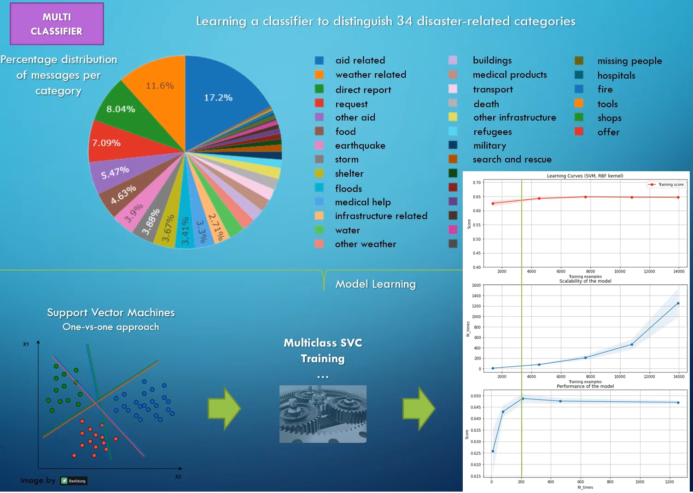
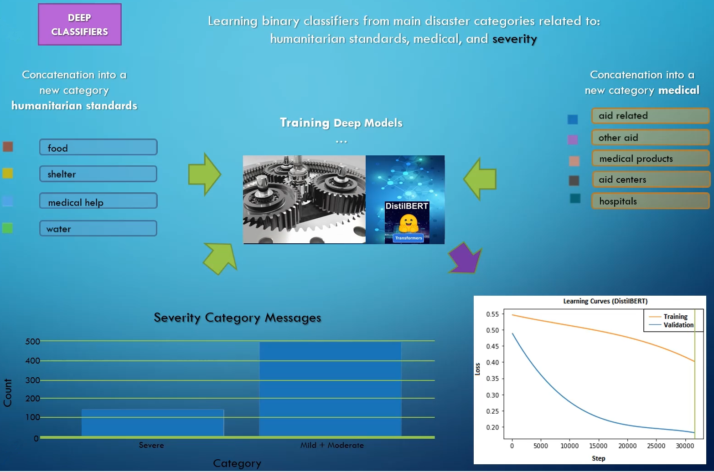
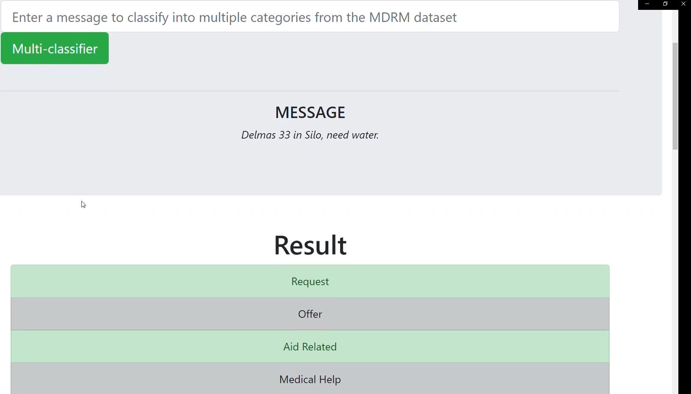
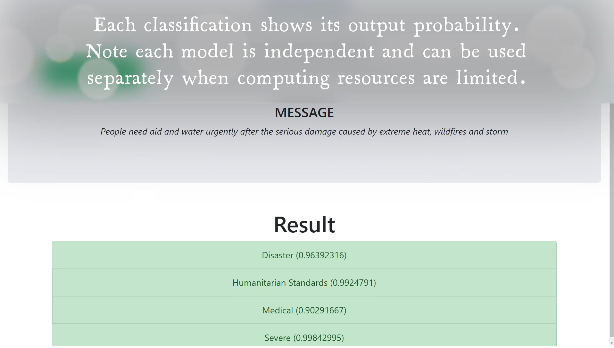

# NLP Disaster 

## Disaster Response Framework and Web App

Natural language processing framework for text analysis in social media data related to disaster and crisis management.

### Dependencies

This code uses Python 3.7.9 running after Miniconda3 environments with a GPU NVIDIA Geforce RTX 2060. The list of dependencies are described in the file _```requirements.yaml```_. To install them using Anaconda/Miniconda, simply create and activate an environment:

```
conda env create --name <your_environment_name> --file=requirements.yaml
conda activate <your_environment_name>
```

### Run the main framework

This is the main disaster filtering framework to train your binary classifiers using both traditional and deep learning BERT-based models.



Once all dependencies are installed, run the main file ```disaster_response.py```

Please, make sure all parameters and paths are correct to import the data and there is no data files missing.

The function ```getDataInfo``` in the file ```utils.py``` contains a list of data files for each dataset. Be sure to load the proper file(s) and keep the target label in ```renamedColumns``` for the supervised classification approaches.

For a more detailed information, please refer to the attached documentation `Re-Energize-DR3_CoreCodeDoc` that can be found in the root directory.

### Web Interface App

The interface is located in the subdirectory ```DisasterResponseApp```

To run the interface app in your local computer, first you need to install and update any missing/deprecated dependencies from the list described in the fil _```requirements.xml```_ within this subdirectory.

Then, run the application file script ```run.py```. The web app server runs in your localhost address, port 5000 by default. You should be able to access through your browser at ```http://localhost:5000/```

Please refer to the README file located in the directory `DisasterResponseApp` for more details of training and evaluation of machine learning models for multiclassification. Further details about the codes can be also found in the attached documentation `Re-Energize_DR3-InterfaceCodeDoc`. We provide you with some self-explanatory images below.

**Multi-classification** of 34 disaster categories and **deep classification** of four main disaster categories:




Visual examples of the **web interface** for classifying messages using the two approaches above:




<a name="authors"></a>
## Authors

* [VPL](https://github.com/vponcelo)
* [CS](https://github.com/catalina2021)

<a name="license"></a>
## License
[](https://opensource.org/licenses/MIT)

This project is licensed under the MIT License - see the [LICENSE](LICENSE) file for details

<a name="acknowledgement"></a>
## Acknowledgements

* [Belmont Forum](https://www.belmontforum.org/archives/projects/re-energize-governance-of-disaster-risk-reduction-and-resilience-for-sustainable-development) first disaster-focused funding Call Belmont Collaborative Research Action 2019: Disaster Risk, Reduction and Resilience (DR32019).

<a name="citation"></a>
## Citation

For any use of this code, please cite our papers as:

<cite>Ponce-López, Víctor and Spataru, Catalina. Social Media Data Analysis Framework for Disaster Response. Research Square preprint, Under Review at Discover Artificial Intelligence, Springer Nature, 2022. [DOI: 10.21203/rs.3.rs-1370942/v1](https://doi.org/10.21203/rs.3.rs-1370942/v1) </cite>

<cite>Ponce Lopez, Victor and Spataru, Catalina. Behaviour in social media for floods and heat waves in disaster response via Artificial Intelligence. ArXiv preprint, Under Review at PLoS ONE, 2022. [DOI: 10.48550/arXiv.2203.08753](https://arxiv.org/abs/2203.08753) </cite>